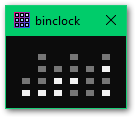
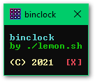

# binshclock
Simple Windows desktop binary clock written in pure C.

Overview
---
I decided to write a very simple desktop binary clock because I find the existing ones too heavy.
binshclock operates entirely in the Windows Console and makes use of the Windows Console API.




Usage
---
Just run the executable! (you may have to get through a SmartScreen dialog if the executable is not signed).
To open the About screen click the bottom-right corner of the window.

Building
---
binshclock has no dependencies besides the Windows system library, so you only need CMake and a working compiler. Personally, I use the TDM-GCC compiler.
```
git clone https://github.com/lemon-sh/binshclock
cd binshclock
mkdir build
cd build
cmake .. -DCMAKE_BUILD_TYPE="Release"
mingw32-make
```
